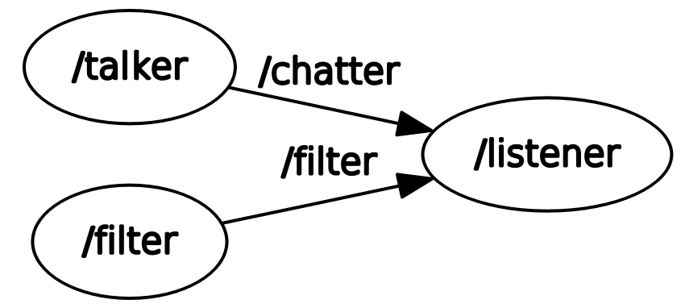

# Laboratorio Ciberfisico - Homework 1
## Specifiche
Si realizzi un package ROS contenente degli opportuni nodi per poter svolgere i compiti seguenti:

- Un nodo pubblica, 1 volta al secondo, un messaggio contenente un nome, un'età, e un corso di laurea
- Un nodo permette di selezionare da tastiera quale parte del messaggio verrà mostrata a video
    + Digitando ‘a’ verrà stampato tutto il messaggio
    + ‘n’ mostrerà solo il nome
    + ‘e’ mostrerà solo l’età
    + ‘c’ mostrerà solo il corso di laurea
- Un nodo mostra a video la parte del messaggio selezionata

## Esecuzione
È necessario clonare il repository nel proprio ROS workspace

    cd <path_to_your_workspace>
    git clone https://github.com/mirkomorati/homework1
    catkin_make 
    roslaunch homework1 all.launch

## Scelte progettuali
Il sistema è organizzato in tre nodi e due topic.



- `talker` si occupa di selezionare un messaggio e pubblicarlo nel topic `chatter` 
- `filter` si occupa di leggere da `stdin` un valore valido e pubblicarlo nel topic `filter`
- `listener` si occupa di visualizzare il messaggio presente nel topic `chatter` secondo i vincoli comunicati nel topic `filter`

Per la comunicazione nel topic `chatter` viene utilizzato un messaggio definito in [msg/student.msg](./msg/student.msg) e qui riportato per comodità
```
string name
uint8  age
string cdl
```

Per il topic `filter` invece viene utilizzato come messaggio un singolo carattere che denota quali parti del messaggio mostrare a video, come da consegna.

Nel nodo `listener` è presente la struttura `ListenerFilter` al cui interno sono definite le callback registrate ai topic opportuni e la variabile `char status`.
Per registrare un metodo di classe come callback è necessario passare una reference al metodo e all'istanza della classe (Si veda [Using class methods as callbacks](http://wiki.ros.org/roscpp_tutorials/Tutorials/UsingClassMethodsAsCallbacks)).
```cpp
ListenerFilter s;
ros::Subscriber filter_sub = n.subscribe("filter", 1, &ListenerFilter::changeStatusCallback, &s);
```

In questo modo si evita l'utilizzo di variabili globali.
